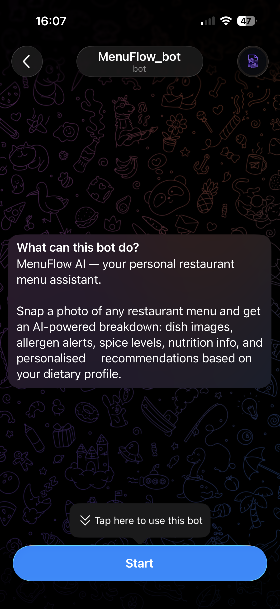
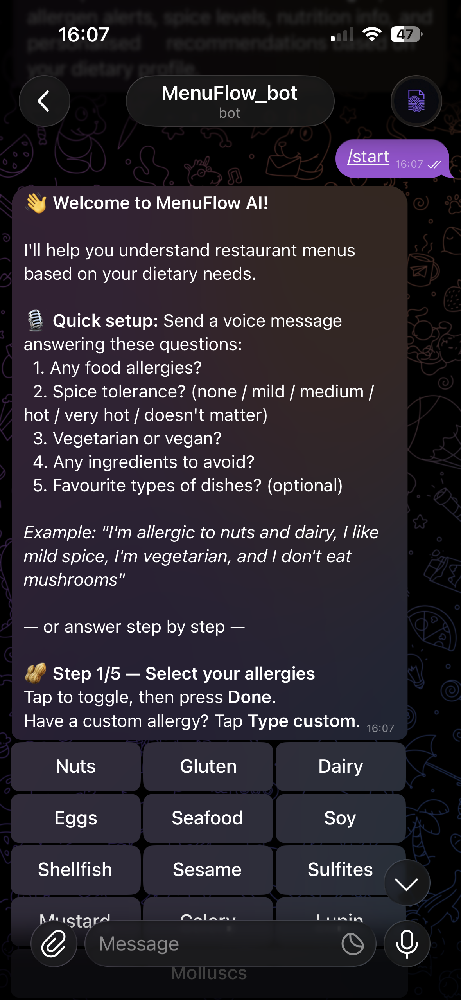
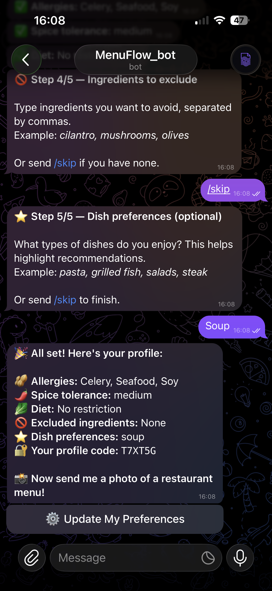
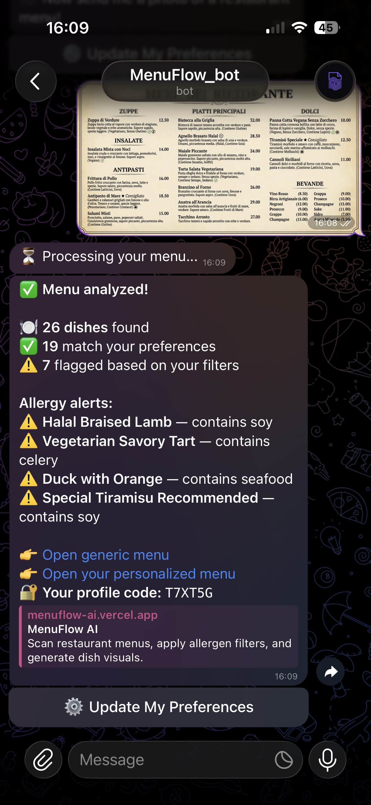
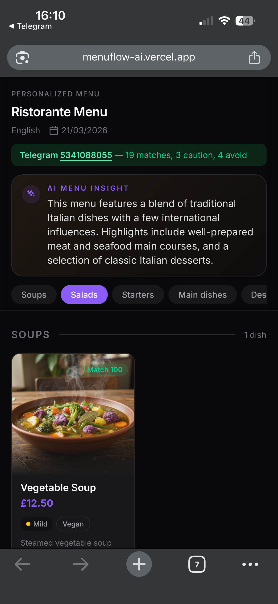

# MenuFlow AI

In 2026, consumers expect personalization by default. Restaurant menus still do not.

Let’s be honest: menus are too generic. They are not tailored to the person reading them, they rarely explain dishes clearly, they do not adapt to allergies or food preferences, and sometimes they are written in a language the diner does not even understand. Even when a translation exists, it still does not tell you what the dish really is, what it may contain, what it might look like, or whether it is actually a good fit for you.

That is the real problem MenuFlow AI solves.

MenuFlow AI turns any restaurant menu into a personalized digital menu with dish explanations, allergen context, nutrition values, generated food visuals, and recommendations tailored to the diner. The user interacts through Telegram, sends a menu photo, and receives both a generic shareable menu page and a personalized version that reflects their own profile.

It is not just translation. It is a better interface for choosing what to eat.

## Screenshots

Portrait screenshots work best here because the product is experienced like a mobile app.

### Workflow Gallery

<p align="center">
  
  
  
  
  
</p>

## Problem Statement

Restaurant menus are still designed like static artifacts from another era.

They assume:

- you understand the language
- you understand the cuisine
- you know what the dish name means
- you can infer ingredients and allergens
- you can judge whether it fits your diet
- you can imagine what the dish will look like

In real life, that often is not true.

People make food decisions quickly, in unfamiliar environments, while hungry, sometimes abroad, sometimes trying a cuisine they have never been exposed to before. They should not need to interrogate the waiter about every item or guess their way through a menu.

## Solution

MenuFlow AI converts any menu into a useful, personalized digital experience.

- A user sets up a food profile in Telegram.
- They share a menu photo with the bot.
- The app extracts and structures every dish with AI.
- It explains what dishes likely are in plain language.
- It flags possible allergens and dietary fit.
- It estimates spiciness and nutrition values.
- It generates dish images so users can better picture what may arrive.
- It creates a generic public page that can be shared with anyone.
- It creates a personalized version for the original user.
- It lets anyone opening the generic page personalize it for themselves with their own profile token.

The result is a menu that is easier to understand, easier to trust, and much more useful in the moment of ordering.

## Why This Matters

This is bigger than travel.

MenuFlow AI helps when:

- you are in a country where you do not speak the language
- you are trying a cuisine you do not understand
- you have allergies or dietary restrictions
- you want more confidence before ordering
- you want to know what is actually worth trying
- you want a better restaurant experience without overwhelming the waiter

The product sits at the intersection of AI personalization, food discovery, accessibility, and real-world consumer utility.

## Why Telegram First

The product is intentionally Telegram-first because that is where the workflow is most convenient.

- No separate heavy onboarding flow
- Easy to collect allergies, spice tolerance, diet, and food preferences once
- Easy to send a menu photo the second you sit down
- Easy to return both a generic and personalized link
- Easy to share the menu with friends at the table

The website is intentionally focused. It exists to display generated menu pages beautifully and let shared menus become personalized for different people.

## Product Flow

1. The user sets their profile in Telegram.
2. The user sends a restaurant menu photo.
3. MenuFlow AI analyzes the menu and creates a structured digital version.
4. The app generates:
   - a generic menu link for sharing
   - a personalized menu link for the sender
5. The public menu page shows dishes, explanations, spiciness, allergens, nutrition, images, and AI insight about the restaurant or cuisine.
6. A friend opening the generic page can click `Personalize` and enter their own profile token.

## Features

- Telegram-first onboarding and usage
- AI-powered menu extraction from photos
- Structured dishes grouped into menu sections
- AI-generated menu title and restaurant/cuisine insight
- Possible allergen warnings
- Spiciness tagging
- Vegan and vegetarian tagging
- Nutrition estimates per dish
- AI-generated dish images
- Generic shareable menu pages
- Personalized menu views based on user profile
- Upstash Redis-backed live storage

## Tech Stack

- Next.js App Router
- React
- Tailwind CSS
- Gemini for menu extraction
- AI image generation for dish visuals
- Upstash Redis for menus, profiles, and generated assets
- Telegram Bot API for profile setup and menu submission

## Local Development

```bash
npm install
cp .env.example .env.local
npm run dev
```

Open `http://localhost:3000`.

## Environment Variables

The app expects:

- `GEMINI_API_KEY`
- `GEMINI_MODEL`
- `GEMINI_FALLBACK_MODELS`
- `NANOBANANA_API_KEY`
- `NANOBANANA_MODEL`
- `UPSTASH_REDIS_REST_URL`
- `UPSTASH_REDIS_REST_TOKEN`
- `TELEGRAM_BOT_TOKEN`
- `NEXT_PUBLIC_TELEGRAM_BOT_USERNAME`
- `NEXT_PUBLIC_APP_URL`
- `NEXT_PUBLIC_IMAGE_GEN_RPM`

`NANOBANANA_API_KEY` can fall back to `GEMINI_API_KEY` if needed.

## Upstash Redis Setup

1. Create a Redis database in Upstash.
2. Copy:
   - `UPSTASH_REDIS_REST_URL`
   - `UPSTASH_REDIS_REST_TOKEN`
3. Put them into `.env.local`.

## Vercel Deployment

1. Push the repository to GitHub.
2. Import the repository into Vercel.
3. Add all environment variables in Vercel project settings.
4. Redeploy the project.

## Public Routes

- Generic menu: `/menu/:id`
- Personalized menu: `/menu/:id/p/:profileToken`

## Notes

- The menu itself is canonical and shareable.
- Personalization is layered on top of the same base menu rather than regenerating a completely different menu for every person.
- The web app is intentionally narrow in scope: generated menu viewing and personalization.
- Telegram is the primary entry point for user identity and food preferences.
